# SyncBoard Architecture & System Design

SyncBoard is a stateless design-to-canvas sync engine designed to fetch, render, and update screenshots in-place on whiteboards. It supports **Figma** and **Penpot** as design sources, **Miro** as the primary canvas target, and is exploring additional platforms.

---

## Overview

### Quick Status Reference

| Section | Status | What it describes |
|---|---|---|
| 1 Source Adapters | stable / draft | Figma & Penpot (implemented); UXPin, Framer, Lovable, Stitch, Adobe UXP (research) |
| 2 Target Adapters | stable / design | Miro (implemented); Mural, MS Whiteboard (research placeholder) |
| 3 MCP Transport Layer | design | MCP client for sources + MCP server for agents --- architecture exploration |
| 4 Selection Detection | design | Planned feature --- partially built |
| 5 Metadata Registry | stable | Implemented --- exact format in use |
| 6 Duplicate Consolidation | design | Planned feature |
| 7 Rate Limits | stable | Implemented throttles + known quotas |
| 8 Data Transport & Costs | stable | Current cost model + self-hosting guide |
| A Appendix: Chromium Loopback | historical | Research findings --- no longer actionable |
| B Appendix: Architecture Evolution | historical | Decision log --- context only |

### Architectural Principle: Adapter Layers

SyncBoard is organized into three adapter layers, each interchangeable:

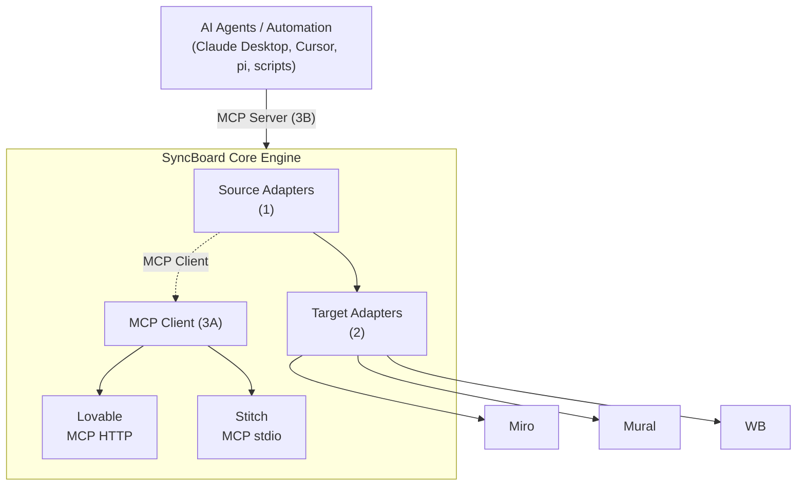

Each adapter implements a uniform interface. Adding a new source means writing a new source adapter; adding a new target means writing a new target adapter. The transport and MCP layers are shared.

---

## 1. Source Adapters

> **Overview:** SyncBoard reads design data from source tools through platform-specific adapters. Two are implemented (Figma, Penpot); five more are under research (UXPin, Framer, Lovable, Stitch, Adobe UXP).

The current production architecture uses two sync strategies depending on the source platform's capabilities:

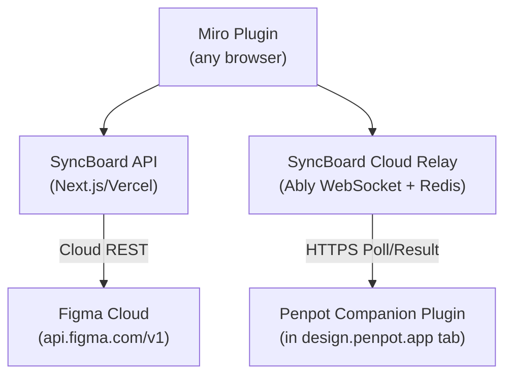

> **Note:** The optional Tauri desktop app (not shown) extends capabilities for large images, Adobe UXP, local LLMs, and two-way sync --- but is not required for the core sync pipeline.

### 1A. Figma --- Cloud-Native REST

> **Status:** stable --- implemented in production.

Figma provides a robust, public web API that renders design frames to images in the cloud.

* **Flow:** The Miro plugin makes a request to the SyncBoard Next.js API. The server requests the frame render directly from Figma's cloud servers (`api.figma.com/v1/images`), downloads the image, and uploads it to the Miro widget.
* **Benefits:** Zero user configuration, no local servers, and no tunnels required.

### 1B. Penpot --- Cloud Relay + Companion Plugin

> **Status:** stable --- implemented in production.

Unlike Figma, Penpot does **not** provide a public REST API that can render design frames into PNG/SVG in the cloud. Syncing Penpot designs uses a cloud relay to coordinate a local browser plugin:

* **The Cloud Limitation:** To render Penpot designs in the cloud, a server must boot a headless browser instance (Puppeteer/Playwright), load the Penpot editor client, authenticate the user, load the heavy WebAssembly editor assets, and take screenshots. This would require hosting expensive rendering nodes.
* **The Relay Solution:** SyncBoard uses the designer's **active Penpot browser tab** as the renderer, coordinated via an **Ably WebSocket** for command delivery and an **Upstash Redis** relay for result storage.
* **Command Delivery (Ably):** The Miro plugin publishes commands to an Ably channel; the Penpot Companion subscribes via WebSocket and executes them instantly using Penpot's native plugin APIs (`penpot.export`). This eliminates idle polling costs completely.
* **Result Storage (Redis):** Results are posted to `/api/relay/penpot/result` (Redis SETEX), and the Miro plugin polls `/api/relay/request` (Redis GET/DEL) synchronously waiting for the response. Redis is only used during active imports, so idle cost is negligible.
* **Flow:** All communication travels over public HTTPS --- no localhost calls required. The Penpot Companion plugin stays connected via a presence heartbeat, and the relay handles timeouts, retries, and pairing.

### 1C. Research: Future Sources

> **Status:** draft --- research findings, not yet integrated.

#### UXPin

> **Status:** draft --- Requires API access validation.

UXPin is the more realistic candidate for a SyncBoard integration. It offers both a REST API and a plugin system, though neither is as refined as Figma's or Penpot's for this use case.

**Cloud-Native Path (Figma pattern)**

UXPin's REST API supports project-level export via `GET /api/v1/projects/{id}/export?format=png`, but at the **page/project level**, not the individual frame level that Figma's `GET /v1/files/{key}/images` provides. A cloud-native integration would:
- Use OAuth 2.0 for authentication (supported).
- Export entire pages as PNG --- requiring cropping or multiple passes to isolate individual frames.
- Reuse the existing `/api/miro/update-image` pipeline with minimal changes.

**Cloud-Relay Path (Penpot pattern)**

UXPin's JavaScript plugin API runs inside the editor and can:
- Read the current selection state (node/frame IDs).
- Interact with the canvas --- though exact export surface area (`uxpin.export` or equivalent) requires verification.

A Penpot-style companion plugin + Ably/Redis relay would mirror the existing pattern, but the lack of a confirmed per-node export API in the plugin sandbox is the main risk.

| SyncBoard Requirement | UXPin Support |
| :--- | :--- |
| REST API for headless frame rendering | Partial --- project/page-level export only, no per-frame batch rendering |
| Plugin export API | Limited --- plugin can read selection but export granularity unclear |
| Plugin selection detection | Plugin API can read selected node |
| OAuth integration | Full OAuth 2.0 |
| Recommended pattern | Hybrid --- page-level cloud export for bulk, plugin relay for selection-driven single exports |

#### Framer

> **Status:** draft --- Pre-deployment: not viable. Post-deployment: partially viable via screenshot of published URL.

Framer has pivoted from a design tool into a website builder (Framer Sites). It exposes a **Plugin API** (client-side, in-editor) and a **Server API** (streaming WebSocket), but both lack the critical capability for SyncBoard's primary use case: extracting frame images from draft projects.

| SyncBoard Requirement | Framer Support |
| :--- | :--- |
| REST API for headless frame rendering | **None**. No render-to-image endpoints. Server API has preview/publish methods but no frame export. |
| Plugin API with export capability | No `export()` or `render()`. Image/Asset API is import-only (`addImage`, `setImage`). Node properties are readable but not renderable to an image. |
| Pre-deployment frame sync | **Not viable**. No export API for draft editor state. Plugin can detect selection but cannot produce an image of it. |
| Post-deployment page sync | Partially viable --- screenshot the published `framer.site/...` URL via Puppeteer. But this captures the whole page, not individual frames. |
| Plugin selection detection | `getSelection()`, `setSelection()`, `subscribeToSelection()` |
| Nodes API | `getNode()`, `setAttributes()`, `subscribeToCanvasRoot()` |
| Server API --- WebSocket | `createConnection()`, `publishPreviewLink()`, `promoteToProduction()`, `getChangePaths()` |
| OAuth integration | For site management and plugin auth. |
| Recommended pattern | **Pre-deployment:** Not viable --- no rendering path exists without expensive headless browser infrastructure (the same problem Penpot solved via companion plugin, but Framer has no `penpot.export()` equivalent). **Post-deployment:** Screenshot the published `framer.site` URL. |

**Key details from the Framer API docs (July 2026):**

**Plugin API capabilities (client-side, runs in the Framer editor):**
- **Canvas selection:** `getSelection()`, `setSelection(nodeIds)`, `subscribeToSelection(callback)` --- can detect which nodes the user has selected.
- **Nodes API:** Low-level `getNode(nodeId)`, `setAttributes(nodeId, attributes)`, `subscribeToCanvasRoot(callback)` --- can read node properties (position, size, colors, layout, visibility, etc.) and modify them.
- **Image/File/SVG API:** `addImage(imageAsset)`, `setImage(imageAsset)` --- but these are **import-only** (add images to the Framer project), not export.
- **CodeFile API:** Create, read, update code files within a Framer project.
- **CMS API:** Read/write CMS collections.
- **Styles API:** Read color and text styles.
- **Data API:** Persistent key-value storage across sessions.

**Server API capabilities (server-side, streaming WebSocket):**
- `createConnection()` --- opens a **persistent WebSocket** to a Framer project. Not REST, not webhooks --- a bidirectional streaming connection.
- `getChangePaths(fromVersion, toVersion)` --- get paths of pages that changed between versions.
- `getChangeContributors(fromVersion, toVersion)` --- get authors of changes.
- `publishPreviewLink()` --- publish a new preview URL.
- `promoteToProduction()` --- promote preview to production.

The Server API FAQ states: *"The Server API uses streaming WebSockets, so it works well for batch processing or LLMs. If you really need to use a REST protocol, you can see how you could expose the API as REST endpoints..."* It is **not transactional** --- error handling must be built in. Free during beta; per-use pricing planned (a few dollars per hour of processing).

**Integration pattern for SyncBoard:**

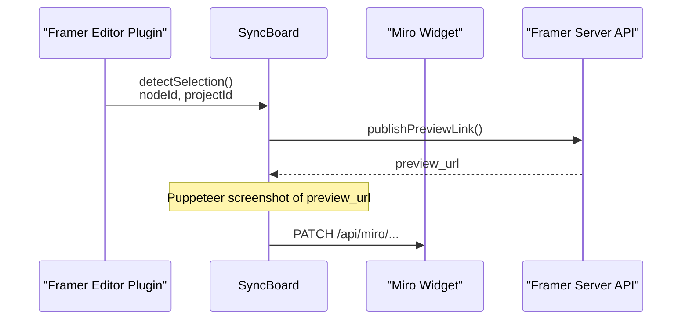

This is the **same pattern as Lovable** --- deploy/preview the project, capture the rendered page, push to Miro. It lacks per-frame granularity (the screenshot captures the entire page), but it's viable for whole-app visual reviews in Miro.

**Limitations:**
- **Pre-deployment: not viable** --- Framer's Plugin API has no `export()` or `render()` equivalent of Penpot's `penpot.export()`. The only way to render non-deployed designs would be expensive headless browser infrastructure (the same problem Penpot solved via companion plugin, but Framer's plugin sandbox doesn't expose rendering hooks).
- **Post-deployment: whole-page only** --- screenshot captures the entire published page, not individual frames or components.
- Plugin runs in Framer's editor (client-side), so selection detection requires the user to have the editor open.
- Server API requires a persistent WebSocket connection (`createConnection()`), adding complexity for any programmatic preview generation.
- No MCP server available (unlike Lovable and Stitch).

**Key Takeaway:** Framer is not viable for SyncBoard's primary use case (pre-deployment design alignment in Miro). It lacks an export API equivalent to Figma's `/v1/images`, Penpot's `penpot.export()`, or Lovable's `get_project` screenshot. UXPin remains the more promising expansion target for direct cloud-native sync due to its per-page export API.

#### Lovable --- MCP Server Integration

> **Status:** draft --- MCP tools verified, integration design in progress.

Lovable is an **AI full-stack app generator** (formerly GPT Engineer), not a design tool. It generates deployed React/TypeScript web applications from natural language prompts --- a fundamentally different category from Figma, Penpot, UXPin, or Framer.

Lovable provides an **official MCP server** (`https://mcp.lovable.dev`, HTTP-based with OAuth) that exposes a comprehensive set of tools relevant to SyncBoard:

| MCP Tool | Description | SyncBoard Relevance |
|----------|-------------|---------------------|
| **`get_project`** | Get project details: editor URL, **preview URL, and a screenshot** | **Returns a screenshot directly** --- no separate capture step needed |
| **`deploy_project`** | Publish a project and get the live URL | Ensures the latest version is deployed before syncing |
| **`list_projects`** | Search and list projects with filtering | Project discovery |
| **`list_workspaces`** | List all workspaces | Workspace navigation |
| **`send_message`** | Send an instruction to the AI builder | Trigger a rebuild before syncing |
| **`get_diff`** | Get unified diff from a message or commit | Review what changed |
| **`list_files`** / **`read_file`** | Inspect project code | Code-level inspection |
| **`get_file_upload_url`** | Get presigned URL to upload a file as message attachment | Upload assets into a project |

**Key insight:** `get_project` returns both a `preview_url` (for live embedding) **and** a `screenshot` (for static image sync). This gives SyncBoard both delivery modes from a single API call --- no html2canvas, no Puppeteer required.

**MCP-native sync flow:**

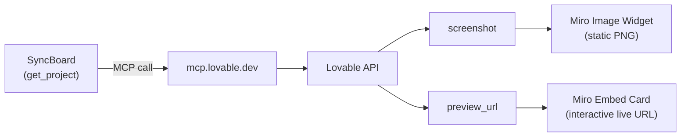

**Two delivery modes from one API call:**
1. **Static screenshot** --- The screenshot from `get_project` can be pushed directly to a Miro image widget via `/api/miro/update-image`, identical to how Figma and Stitch screenshots are handled.
2. **Live embed** --- The `preview_url` can be inserted into a Miro link card, giving stakeholders a clickable path to the real interactive app.

The choice is per-project and per-sync --- SyncBoard could offer a toggle, or use both simultaneously (image + link card).

**Advantages of the MCP approach:**
- Official and maintained by Lovable.
- HTTP transport (no local stdio to manage).
- OAuth handles auth.
- Screenshots are server-rendered by Lovable --- no client-side html2canvas or Puppeteer infrastructure needed.
- Tools like `send_message` + `deploy_project` + `get_project` can be chained: "rebuild, deploy, then sync the screenshot and URL to Miro."

#### Stitch by Google --- MCP Server Integration

> **Status:** draft --- Community MCP server verified, requires Google Cloud setup and stability validation.

Stitch is a Google AI-powered tool that generates mobile and web UI designs from natural language prompts. It is currently in beta. A community-maintained MCP server (`stitch-mcp`, npm package, Apache 2.0) wraps the Google Stitch API and exposes the following tools via the Model Context Protocol:

| MCP Tool | Relevance for SyncBoard |
|----------|------------------------|
| **`fetch_screen_image`** | Downloads a high-res screenshot of a Stitch screen --- **direct replacement for Figma's rendering API** |
| **`list_projects`** | Lists all Stitch projects (equivalent to Figma file browsing) |
| **`list_screens`** | Lists screens within a project (equivalent to Figma frame listing) |
| **`get_screen`** | Gets metadata for a specific screen |
| **`generate_screen_from_text`** | Generates a new screen from a text prompt |
| **`fetch_screen_code`** | Downloads raw HTML/frontend code of a screen |
| **`extract_design_context`** | Extracts design tokens (fonts, colors, layout) from a screen |

**Prerequisites to use the Stitch MCP:**
1. A Google Cloud project with the Stitch API enabled (`gcloud beta services mcp enable stitch.googleapis.com`).
2. Application-default credentials (`gcloud auth application-default login`).
3. The `stitch-mcp` npm package (`npx -y stitch-mcp` with `GOOGLE_CLOUD_PROJECT` env var).

**Potential SyncBoard integration pattern --- MCP-native sync:**

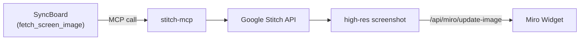

This would represent a **third sync pattern** for SyncBoard, distinct from the Figma cloud-native and Penpot cloud-relay patterns:
- **Transport:** MCP protocol (stdio or TCP) --- same protocol already used by context-pipe and the AI agent ecosystem.
- **Rendering:** Cloud-based (like Figma), no user browser needed.
- **Auth:** Google Cloud application-default credentials (service account or user ADC).
- **No plugin required** --- all operations are server-side API calls.

**Caveats:**
- The `stitch-mcp` package is **third-party** (by Aakash Kargathara), not an official Google product. Its stability depends on the Stitch API surface remaining stable.
- Requires a Google Cloud project with billing for the Stitch API.
- Screens must already exist in Stitch (generated via `generate_screen_from_text` or the Stitch UI).
- The MCP server runs as a local stdio process --- SyncBoard would need to manage the subprocess or connect to a hosted MCP endpoint.

**Verdict:** Stitch becomes the **most immediate expansion candidate** for SyncBoard. The MCP bridge bypasses the unknowns identified above --- export, auth, and tooling are all confirmed to work through the community MCP server.

#### Adobe UXP

> **Status:** draft research --- Two potential integration paths identified: UXP plugin relay (Tauri-dependent) and Cloud Storage API (cloud-native, pending validation).

Adobe has two distinct API surfaces relevant to SyncBoard: the **UXP plugin runtime** (local, for selection detection and export within Adobe apps) and the **Adobe Cloud Storage API** (cloud-based, for file-level operations on Creative Cloud assets). Neither is as refined as Figma's rendering API, but together they offer two complementary integration paths.

| SyncBoard Requirement | Adobe UXP (local) | Adobe Cloud Storage API (cloud) |
| :--- | :--- | :--- |
| REST API for headless rendering | UXP is a local runtime --- no cloud API. | **Partial** --- `GET /files/{assetId}/image-rendition` exists. Returns an image rendition of a file. Needs validation on: file type support (PSD/AI?), format (PNG/JPEG?), resolution, layer/page granularity. |
| Plugin export capability | UXP has Document API. Export methods (`saveAs`, `exportFile`) exist in some apps but granularity varies. | Cloud API is file-level --- no canvas/selection access. |
| Selection detection | `app.activeDocument`, `selection` | Cloud API has no concept of canvas selection. |
| Plugin UI panels | UXP supports HTML/CSS/JS panels | |
| Connection model | Local IPC via Tauri socket | REST (HTTPS) --- cloud-native, no Tauri needed |
| Auth | Local (no auth needed) | OAuth 2.0 (Adobe Developer Console) |
| Recommended pattern | **Tauri relay** --- UXP plugin reads selection -> Tauri triggers export -> pushes to Miro. | **Cloud-native (Figma pattern)** --- List files in a Creative Cloud project -> call `image-rendition` for each -> push to Miro. Lacks per-layer granularity but works serverless. |

---

#### Cloud Storage API Path (Cloud-Native)

The Adobe Cloud Storage API (`developer.adobe.com/cloud-storage`) provides enterprise-level access to Creative Cloud projects, folders, and files. Key endpoints for SyncBoard:

| Endpoint | Relevance |
|----------|-----------|
| `GET /projects` | List Creative Cloud projects (equivalent to Figma file browsing) |
| `GET /projects/{assetId}/children` | List files within a project (discover PSD/AI files) |
| `GET /files/{assetId}/image-rendition` | **Returns an image rendition of a file** --- potential cloud-native rendering path |
| `GET /files/{assetId}` | Get file metadata |
| `POST /files/upload/*` | Upload files (useful for round-trip: generate in Miro -> upload back to Creative Cloud) |

**Unanswered questions:**
- Does `image-rendition` work for PSD/AI design files, or only for raster images?
- What format/resolution is the rendition? (thumbnail-quality or print-ready?)
- Can it render specific layers/pages, or just the full document composite?
- Is this endpoint available on all Creative Cloud plans or only enterprise?

**If validated,** this would enable a **pure cloud-native path** for Adobe:

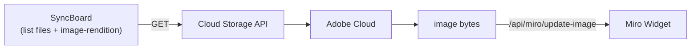

No Tauri, no UXP plugin, no local process needed. Same pattern as Figma's cloud-native sync.

---

#### UXP Plugin Path (Tauri-Dependent)

Adobe UXP (Unified Extensibility Platform) is Adobe's cross-app plugin system for Photoshop, Illustrator, InDesign, and formerly Adobe XD. Unlike Figma or the Cloud Storage API, UXP runs locally inside the Adobe app process. This path is relevant when **per-layer/per-frame granularity** is needed --- the Cloud Storage API's `image-rendition` returns whole-file composites only.

**Integration path (Tauri relay):**

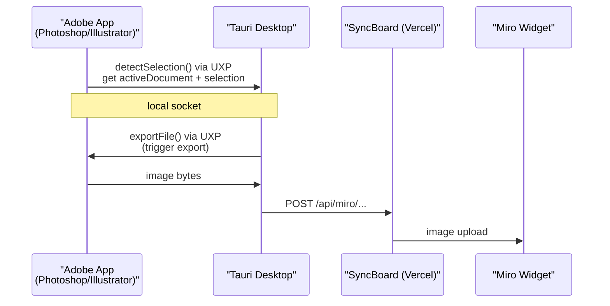

**Current status in SyncBoard:**
- Listed in the Selection Detection Strategy (4) as a planned UXP plugin -> Tauri local socket path.
- Referenced in Appendix B as a Tauri capability extender use case.
- No active implementation --- requires building a UXP plugin for the target Adobe app and verifying the export API surface.

**Caveats:**
- Adobe XD's sunset means the relevant UXP target is now Photoshop/Illustrator, which have different document models than UI design tools.
- Export format and quality need verification --- Photoshop can export PSD layers as PNGs, but the programmatic surface (`exportFile`, `saveForWeb`) varies by app and version.
- Requires Tauri desktop app running (no pure cloud path).
- UXP manifest permissions must include document read/export access.

---

## 2. Target Adapters

> **Overview:** SyncBoard writes synchronized design data to whiteboard platforms through target-specific adapters. Miro is the primary target. Mural and Microsoft Whiteboard are under consideration.

### 2A. Miro --- Image Widgets

> **Status:** stable --- implemented in production.

Miro is SyncBoard's primary canvas target. SyncBoard pushes screenshots to Miro image widgets via the **Miro REST API** (widget creation, image PATCH) and reads widget metadata via the **Miro Web SDK v2** (sidebar panel, selection detection).

**Transport:**
- **Create/update images:** `PATCH /v2/boards/{boardId}/images/{itemId}` with multipart image upload.
- **Read metadata:** `miro.board.getById()` via Web SDK.
- **Sidebar UI:** Miro Web SDK `miro.board.ui.openPanel()` for the SyncBoard control panel.

**Widget metadata storage:**

Metadata is stored on each Miro image widget via `widget.setMetadata('syncboard', ...)`. See 5 for the exact schema.

**Rate limits:** See 7C.

### 2B. Research: Future Targets

> **Status:** design --- placeholder for future investigation.

The source-adapter and target-adapter architecture means adding a new whiteboard target is isolated from source logic. The following targets are under consideration:

| Target | Transport | Image Widget Type | Status |
|--------|-----------|-------------------|--------|
| **Mural** | REST API (REST API) | Sticky notes / images | historical Research needed --- verify Mural API supports programmatic image creation |
| **Microsoft Whiteboard** | Graph API | Surface API image strokes | historical Research needed --- verify via `graph.microsoft.com/v1.0/me/whiteboard` |
| **FigJam** | Figma REST API | Same as Figma frames | draft Draft --- uses Figma's existing API surface, may share source adapter logic |
| **Excalidraw** | Self-hosted REST | `POST /api/v2/scenes` | design Design --- open API, self-hosted friendly |
| **tldraw** | Embedded SDK | `TldrawImage` component | design Design --- embeddable, programmable |

> Note: Mural and MS Whiteboard research started pending API access validation. See `doc/backlog.md` for tracking.

---

## 3. MCP Transport Layer

> **Overview:** SyncBoard uses the Model Context Protocol (MCP) in two directions --- as a **client** to consume design-source MCP servers (Lovable, Stitch), and as a **server** to expose SyncBoard tools to AI agents.

### 3A. SyncBoard as MCP Client

> **Status:** draft --- transport implementation verified with `@modelcontextprotocol/sdk` v1.29.0+.

SyncBoard can act as a **remote MCP client** using the official `@modelcontextprotocol/sdk` (v1.29.0+). This enables SyncBoard (running on Vercel serverless) to call MCP servers over HTTP just like any REST API --- no subprocess management required for remote MCP endpoints.

#### Supported MCP Transports

| Transport | SDK Transport Class | Used For | Subprocess? | Serverless Compatible? |
|-----------|-------------------|----------|-------------|----------------------|
| **Streamable HTTP** | `StreamableHttpClientTransport` | Lovable MCP (`mcp.lovable.dev`) | --- pure HTTP | Plain `fetch()` |
| **stdio** | `StdioClientTransport` | Stitch MCP (`stitch-mcp`) | `npx stitch-mcp` | Requires hosted subprocess manager |
| **SSE** | `SseClientTransport` | Future MCP servers with SSE | | (long-lived connection) |
| **WebSocket** | `WebSocketClientTransport` | Future real-time MCP servers | | Requires connection mgmt |

#### MCP Client --- Lovable Pattern

For HTTP-based MCP servers like Lovable's, the integration is a standard JSON-RPC call over HTTPS:

```typescript
import { Client } from "@modelcontextprotocol/sdk/client/index.js";
import { StreamableHttpClientTransport }
 from "@modelcontextprotocol/sdk/client/streamableHttp.js";

async function callLovableTool(accessToken: string, tool: string, args: object) {
 const transport = new StreamableHttpClientTransport({
 url: new URL("https://mcp.lovable.dev"),
 auth: { bearerToken: accessToken },
 });

 const client = new Client(
 { name: "syncboard", version: "1.0.0" },
 { capabilities: {} }
 );

 await client.connect(transport);
 return client.callTool({ name: tool, arguments: args });
}
```

**Routing logic inside SyncBoard's API routes:**

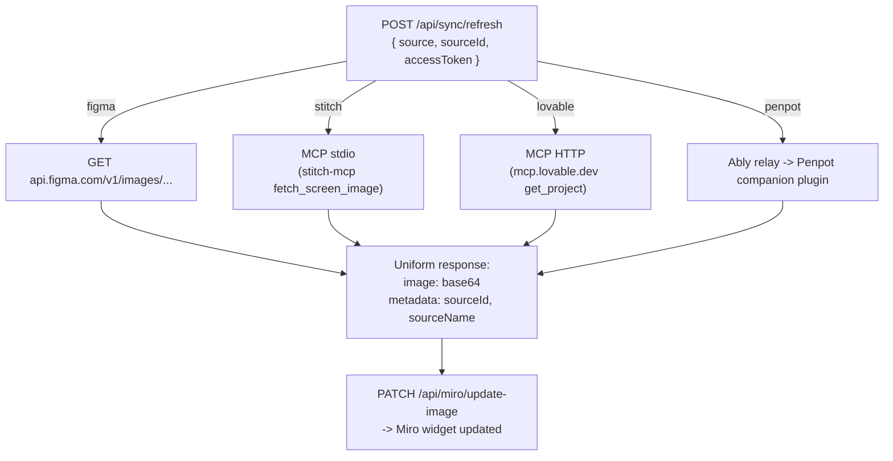

#### OAuth Flow for Remote MCP

Lovable's MCP server uses the standard MCP OAuth flow. SyncBoard handles this as a multi-step dance:

1. User clicks **"Connect Lovable"** in the SyncBoard Miro sidebar.
2. SyncBoard redirects to Lovable's OAuth authorization page (`https://mcp.lovable.dev/auth/authorize`).
3. User signs in and grants access to SyncBoard.
4. Lovable redirects back to `api/auth/lovable/callback?code=...`.
5. SyncBoard exchanges the auth code for access + refresh tokens.
6. Tokens are stored encrypted (Vercel KV or database), associated with the SyncBoard user session.
7. All subsequent `get_project` / `deploy_project` calls use the cached access token.

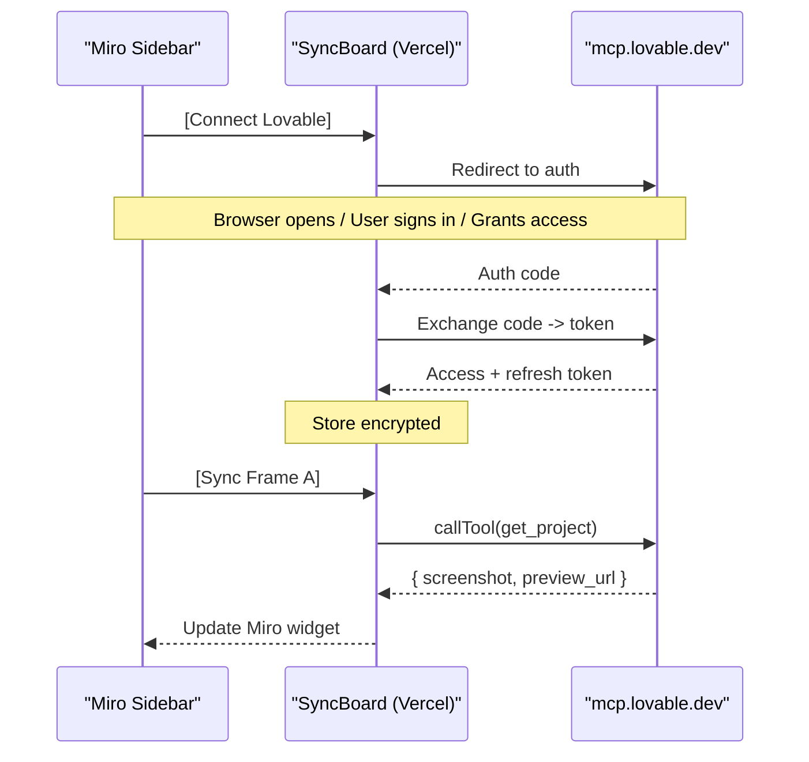

#### Source Adapter Pattern

All source integrations (Figma, Stitch, Lovable, Penpot) converge through a uniform adapter interface. The Miro sidebar panel does not need to know which source a widget is linked to --- it just calls refresh with the stored metadata:

```typescript
interface SyncSourceAdapter {
 source: "figma" | "stitch" | "lovable" | "penpot";
 refresh(params: {
 sourceId: string; // nodeId / screenId / projectId
 projectId?: string; // fileKey / stitch project
 accessToken?: string; // pre-authorized token
 }): Promise<{
 image: string; // base64-encoded PNG
 metadata: {
 sourceName: string; // human-readable name for logging/display
 previewUrl?: string; // Lovable/Stitch only: link to live app
 };
 }>;
}
```

| Source | Transport | Adapter Module | Per-Frame? | Auth |
|--------|-----------|----------------|-----------|------|
| **Figma** | REST (native HTTP) | `adapters/figma.ts` | | OAuth 2.0, per-user |
| **Stitch** | MCP stdio (`stitch-mcp`) | `adapters/stitch.ts` | (per-screen) | Google ADC, per-instance |
| **Lovable** | MCP HTTP (`mcp.lovable.dev`) | `adapters/lovable.ts` | (whole project) | MCP OAuth, per-user |
| **Penpot** | Cloud relay (Ably + Redis) | `adapters/penpot.ts` | (per-frame) | Plugin pairing token |

The `@modelcontextprotocol/sdk` is used in the **Stitch** and **Lovable** adapters internally. Figma and Penpot use their respective native transports (REST and relay), but all four present the same `SyncSourceAdapter` interface to the rest of SyncBoard.

#### Why This Matters

- **Lovable MCP becomes the lightest integration** --- pure HTTP, no subprocess, no companion plugin, no relay. The same SDK call pattern works for any future MCP server that implements Streamable HTTP transport.
- **Stitch MCP requires a subprocess** --- SyncBoard would need to run `npx stitch-mcp` as a managed child process or proxy it through a hosted endpoint. This is heavier than Lovable's pattern but still simpler than the Penpot relay.
- **MCP is a first-class transport** alongside REST and relay --- not a replacement for any of them, but a new option for sources that expose an MCP server.

### 3B. SyncBoard as MCP Server

> **Status:** design --- architecture explored, not yet implemented.

Just as SyncBoard acts as an **MCP client** to Lovable and Stitch, it can also act as an **MCP server** --- exposing its own tools to AI agents (Claude Desktop, Cursor, pi, custom scripts). This is the architectural symmetry: SyncBoard consumes MCP tools from design sources and exposes MCP tools for board operations.

#### Exposed Tools

| Tool | Description | What an agent would ask |
|------|-------------|------------------------|
| **`sync_frame`** | Fetch latest from source (Figma/Stitch/Lovable) and push to Miro widget | "Sync the login screen to the board" |
| **`list_widgets`** | List all synced widgets on a board with source metadata | "What's on the board right now?" |
| **`get_status`** | Check sync freshness of a specific widget | "Is the home screen up to date?" |
| **`batch_sync`** | Sync multiple frames in one call | "Sync all Figma frames to Miro" |
| **`list_projects`** | List connected source projects (Figma files, Stitch projects, Lovable projects) | "What designs are available?" |
| **`list_sources`** | Show which design accounts are linked to SyncBoard | "Which Figma account is connected?" |

#### Symmetric Architecture

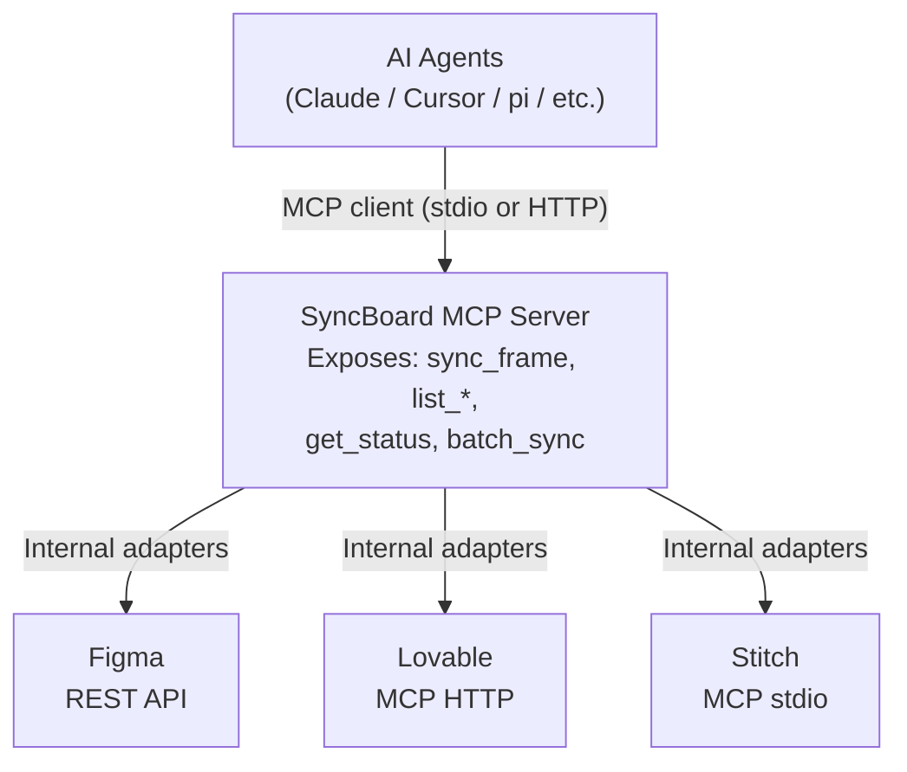

SyncBoard sits in the **middle** --- MCP server facing agents, MCP client facing design sources. Every MCP tool call maps 1:1 to an existing adapter method (listed in the Source Adapter Pattern above).

#### Deployment: Two Transport Options

**Option A --- stdio (npm package, local agents)**

```bash
# Install once
npm install -g @syncboard/mcp-server

# Claude Desktop config:
{
 "mcpServers": {
 "syncboard": {
 "command": "npx",
 "args": ["-y", "@syncboard/mcp-server"]
 }
 }
}
```

- Runs on the user's machine --- **$0 infra cost**.
- Tokens stored locally (file or OS keychain).
- No Tauri dependency --- the agent launches the process directly.
- Agents connect via stdio (Claude Desktop, Cursor) or TCP (pi, custom scripts).

> **Tauri's optional role:** Tauri could provide a GUI for managing tokens (Figma, Miro, Lovable credentials) and launch the stdio MCP server as a child process. But the MCP server itself must work without Tauri --- any agent should be able to call SyncBoard without opening a desktop app.

**Option B --- Streamable HTTP (Vercel-hosted, remote agents)**

```
Route: https://syncboard.vercel.app/api/mcp
Transport: Streamable HTTP (POST JSON-RPC)
Auth: API key or session token
```

- Hosted on the **same Vercel project** as SyncBoard's existing API --- one additional route.
- Calls the **same adapter code** as the REST endpoints --- no new functions, databases, or services.
- **Cost impact: zero.**

| Resource | Without MCP Server | With MCP Server | Delta |
|---|---|---|---|
| Vercel function invocations | 1 per sync call | 1 per MCP tool call (same work) | **Zero** --- same adapter code |
| Vercel function duration | ~200-800ms | ~200-800ms | **Zero** --- same adapter code |
| Vercel bandwidth | Image downloads/upload | Image downloads/upload | **Zero** --- same data flow |
| Vercel route count | Existing endpoints | +1 route (`/api/mcp`) | **Negligible** (~1KB routing) |
| Additional infrastructure | None | None | **Zero** --- same adapters, same tokens, same API calls |

#### Self-Hosting Impact

For anyone self-hosting SyncBoard (VPS, Docker, or other), both options are straightforward:

| Aspect | stdio (Option A) | HTTP (Option B) |
|---|---|---|
| Installation | `npm install @syncboard/mcp-server` | Add one route to existing app |
| Agent connection | Claude/Cursor config | `POST http://self-hosted:port/api/mcp` |
| Token storage | Local file or OS keychain | Environment variables or DB |
| OAuth callbacks | Not needed (local tokens) | Must point at self-hosted URL |
| Cost | $0 --- runs on user's machine | Same as existing hosting cost |

#### Relationship to the Miro Sidebar

The SyncBoard MCP server does **not** replace the Miro sidebar plugin --- they serve different interaction modes:

| Mode | Interaction | Best for |
|---|---|---|
| **Miro sidebar** | User clicks buttons in Miro UI | Visual designers, real-time review |
| **MCP server (agent)** | Agent calls tools programmatically | Automation, CI/CD, natural language commands, non-technical stakeholders |
| **Both** | Sidebar shows status, agent triggers syncs | Power users who want UI + automation |

An agent calling `sync_frame` does exactly what the sidebar's "Sync" button does --- it calls the same `SyncSourceAdapter` under the hood. The two are interchangeable: a user can sync via the UI, or tell an agent "refresh the login screen" without opening the board.

---

## 4. Selection Detection Strategy

> **Status:** design --- Penpot relay implemented, Figma relay planned.

Selection detection sources vary by platform and evolve toward a uniform relay pattern:

| Platform | Current Method | Future Direction |
| :--- | :--- | :--- |
| **Penpot** | Companion receives commands via Ably WebSocket | Stable --- relay-first |
| **Figma** | (Planned) Figma plugin -> relay | Figma plugin + relay (mirror Penpot pattern) |
| **Adobe** | (Planned) UXP plugin -> Tauri local socket | Tauri capability extender |

### Current Implementation

- **Penpot:** The Penpot Companion plugin (`penpot-companion-ui.html`) connects via WebSocket (Ably), subscribes to the pairing channel for `select` or `export` commands, executes them using Penpot's native plugin API, and returns results through the relay.
- **Figma (SyncBridge fallback):** When Tauri is installed, it can query the Figma Desktop MCP port (`127.0.0.1:3845/mcp`) locally via native HTTP on the Rust side --- this is the only remaining Tauri dependency and will be replaced by the Figma plugin + relay.

### Why Not Tauri for Transport?

Chrome PNA blocks all browser -> localhost calls from public origins. Even with valid SSL and correct CORS+PNA headers, both `fetch()` and `WebSocket` are denied. Tauri remains valuable as a **capability extender** (see Appendix B), not as a transport bridge.

---

## 5. Stateless Metadata Registry

> **Status:** stable --- implemented in production.

SyncBoard stores all design connection metadata directly in the Miro widget. No databases are required to track which widget maps to which design frame.

* **Figma Image Title Signature:** `Node Name [SyncBoard|fileKey|nodeId]`
* **Penpot Image Title Signature:** `Node Name [PenpotSync|fileKey|nodeId]`
* **Metadata Payload:** Inside the Miro image widget's metadata (`image.getMetadata().syncboard`):

```json
{
 "fileKey": "UUID_or_FileKey",
 "nodeId": "Frame_Node_ID",
 "nodeName": "Home Screen",
 "format": "png" | "svg",
 "scale": 1 | 2 | 3 | 4,
 "platform": "figma" | "penpot"
}
```

---

## 6. Duplicate Card Consolidation

> **Status:** design --- planned feature.

To prevent clutter in the Miro plugin sidebar, SyncBoard groups identical selected canvas widgets (same `fileKey` + `nodeId` signature) into a single card:

* Shows a count badge (e.g. `x3`) in the top-right corner.
* Modifying settings (like resolution scale or format) on the grouped card instantly updates all matching widgets on the canvas.
* Users can toggle **"Also update all board copies"** to automatically apply updates to every copy of that frame on the board in a single click.

---

## 7. Rate Limits & Quotas

> **Status:** stable --- implemented throttles.

SyncBoard includes built-in throttles to comply with Figma and Miro API rate limit restrictions.

### A. Figma API Quotas

Figma limits the `GET /v1/images` endpoint based on user plan tiers:
* **Starter (Free) Plan:** Limited to **6 image requests per month** per account. Once reached, Figma blocks requests for up to 4.5 days.
* **Paid Plans (Professional/Enterprise):** 10 to 20 requests per minute.
* **SyncBoard Optimization:** SyncBoard batches all requested frames from the same file into a single HTTP request to minimize quota consumption.

[Figma Rate Limits](https://developers.figma.com/docs/rest-api/rate-limits/#rate-limits-tier-table)

### B. Penpot API Quotas

Unlike Figma, Penpot does not enforce API rate limits or monthly quotas for exports. Rendering happens locally in the Penpot browser tab; only the command coordination and result transport pass through cloud infrastructure.
* **No Cloud Rendering Costs:** The actual SVG/PNG rendering runs on the user's GPU/CPU inside the Penpot browser tab --- no cloud rendering servers needed. Image data does flow through Vercel and Redis ephemerally during transport (see 8.B), but this is lightweight passthrough, not cloud compute.
* **No API Quotas:** Penpot does not rate-limit plugin API calls. You can sync unlimited frames with no pricing tiers or usage caps.
* **Relay overhead per sync:** Each Penpot export generates ~2-4 Redis commands (result store only) and 2 Vercel function invocations (relay request + Miro update). See 8.C for size constraints.

### C. Miro API Quotas

Miro limits heavyset widget operations (like uploading and PATCHing images) to **50 requests per minute** per user token.
* **SyncBoard Optimization:** Includes a **500ms delay** between consecutive widget updates to prevent hitting Miro's limit.

[Miro Rate Limits](https://developers.miro.com/reference/rate-limiting)

---

## 8. Data Transport & Infrastructure Costs

> **Status:** stable --- current cost model.

Understanding where image bytes travel is critical for self-hosters evaluating hosting costs and limits. This section traces the data path for each sync pipeline and explains the cost implications.

### A. Figma Sync Path (Cloud-Native)

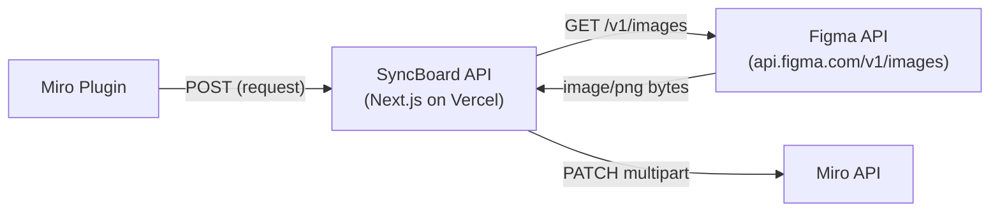

**Where bytes travel:**
1. Figma API -> Vercel (image download, full binary)
2. Vercel -> Miro API (image upload, full binary as multipart form)

**Image bytes pass through Vercel twice** --- download from Figma, then upload to Miro. This counts against Vercel's function execution time (max 60s on Pro) and outbound bandwidth.

### B. Penpot Relay Path (Cloud-Relay)

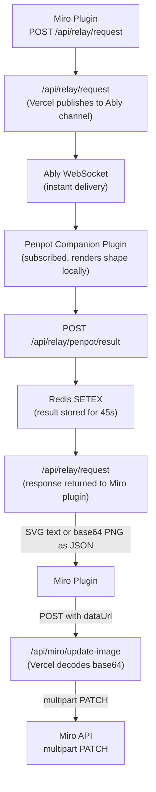

**Where bytes travel:**
1. Penpot plugin -> Redis (SVG string or base64 PNG, stored as JSON value, 45s TTL)
2. Redis -> Vercel `/api/relay/request` response (image data returned to Miro plugin)
3. Miro plugin -> Vercel `/api/miro/update-image` (image data sent as `dataUrl`)
4. Vercel -> Miro API (image upload after base64 decode)

Image bytes pass through **Redis ephemerally** (step 1-2) and **Vercel twice** (step 2 response, step 3-4 upload).

### C. Size Constraints & Where They Apply

| Constraint | Limit | Affected Path | Mitigation |
| :--- | :--- | :--- | :--- |
| Vercel serverless body size | **4.5 MB** (Hobby & Pro) | All paths --- request body sent to Vercel | Tauri direct upload (future); compress images before sync |
| Vercel serverless response size | **4.5 MB** (Hobby & Pro) | `/api/relay/request` returning image data | Tauri direct upload (future); use SVG when possible (more compact) |
| Vercel execution timeout | **10s** (Hobby), **60s** (Pro), **900s** (Enterprise) | `/api/miro/update-image` --- large images take time to download/upload | Keep images under 1MB for Hobby plan; upgrade to Pro for larger |
| Vercel outbound bandwidth | **100 GB/mo** (Hobby), **1 TB/mo** (Pro) | Figma path downloads image; all paths upload to Miro | SVG format uses ~10x less bandwidth than PNG; Tauri direct upload bypasses Vercel entirely |
| Vercel function invocations | **100k/mo** (Hobby), **10M/mo** (Pro) | Each sync operation = 1 relay request + 1 update-image call | Batch exports reduce calls; see 6 |
| Redis value size | **~512 MB** (Upstash max) | Relay result payload returned to Miro plugin | Practical limit is Vercel's 4.5 MB response size, not Redis |
| Redis commands/mo | **10k/day** (Upstash Free), **100k/day** (Pay-as-you-go ~$0.15/1k) | Each result store/retrieve/delete = 1 command | Each sync run = ~2-4 Redis commands (result store, poll, delete). Zero idle cost --- Ably handles delivery. |
| Redis storage | **50 MB** (Upstash Free), **1 GB** ($0.15/GB) | Ephemeral command queue + result cache (45s TTL) | Negligible --- data auto-expires; no persistent growth |

### D. Cost Estimates for Self-Hosters

| Scenario | Vercel Plan | Upstash Plan | Monthly Cost | Notes |
| :--- | :--- | :--- | :--- | :--- |
| Personal use, light sync | Hobby (free) | Free (10k cmd/day) | **$0** | Stay under 4.5MB per image, under 100k invocations |
| Team, regular Figma sync | Pro ($20/mo) | Free (10k cmd/day) | **$20/mo** | 1TB bandwidth, 60s timeout handles larger images |
| Heavy Penpot sync, large SVGs | Pro ($20/mo) | Free (~$0) | **$20/mo** | Redis used only for result storage (~2-4 commands per sync). Ably free tier (200k msg/mo) covers delivery. |
| Large images needing >4.5MB | Pro + Tauri extender | Free ($0) | **$20/mo** | Tauri handles direct Miro upload, bypassing Vercel body limit |

### E. Why This Architecture Is Cost-Efficient

1. **No persistent servers** --- Vercel is serverless (pay-per-call), Upstash is serverless Redis (pay-per-command). No EC2, no VPS.
2. **No cloud rendering** --- Unlike a Puppeteer-based solution that would need a persistent GPU instance (~$50-200/mo), rendering happens in the user's browser tab at zero cloud cost.
3. **No image storage** --- Images flow through Vercel/Redis ephemerally and land in Miro. No S3, no CDN, no persistent blob storage.
4. **SVG-first for vector designs** --- SVGs are typically 10-50 KB vs 200-500 KB for PNG equivalents, drastically reducing bandwidth and storage costs.

### F. When Tauri Reduces Infrastructure Costs

| Scenario | Without Tauri | With Tauri | Savings |
| :--- | :--- | :--- | :--- |
| 5 MB PNG export | Fails (Vercel 4.5MB limit) | Uploads directly to Miro API | Unblocks feature |
| 100 daily syncs x 500 KB PNG | ~50 GB Vercel bandwidth/mo | ~0 GB bandwidth (Tauri->Miro direct) | Stays within Hobby plan |
| Batch 50 images | 50 Vercel invocations | 0 invocations (Tauri batches locally) | Saves function quota |

In short: the cloud relay path handles **small-to-medium payloads** efficiently at near-zero cost. Tauri is only needed when you hit the 4.5MB ceiling or want to eliminate Vercel bandwidth entirely.

### G. Deprecation of Local Tauri Transport for Penpot

Following structural security audits, the local Tauri transport pathway for Penpot (where commands were routed locally via WebSocket port `4401` to the companion plugin) was **deprecated and removed**.

All Penpot commands are now routed exclusively through the secure **Cloud Relay Path (Section B)** using Ably and Redis. This change:
* Eliminates browser-level Mixed Content and Private Network Access (PNA) blockages inside Penpot.
* Simplifies client-side transport logic in the Miro plugin.
* Standardizes security validation across all browsers and desktop clients.

Tauri remains active strictly as a local capability extender (e.g. Figma Desktop local selection querying on port `3845` and future Adobe UXP integrations).

---

## Appendix A: Chromium Loopback & Sandboxing Security

> **Status:** historical --- research findings documented for reference, no longer actionable.

During development and security auditing, we uncovered several strict browser-level constraints regarding secure loopback requests from inside Miro's iframe environments. These are documented below to guide future architectural decisions.

### A. Chromium Local Network Access (LNA) Iframe Restriction

Modern Chromium browsers completely block public websites inside cross-origin `iframe` containers from making requests to the local network or loopback (`127.0.0.1`/`localhost`), regardless of CORS or SSL certificate validity.

* **The Constraint:** Unless the parent page (`miro.com`) explicitly sets `allow="loopback-network"` on the iframe element, the browser blocks all loopback fetch and WebSocket connections.
* **The Solution:** The Miro Desktop App (built on Electron) is not subject to this strict sandboxing rule, allowing the Miro plugin to query the local `https://local-syncboard.luiskobayashi.com:4401` companion server directly.

### B. Strict CORS Private Network Access (PNA) Preflights

When LNA is bypassed (e.g., inside Electron/Miro Desktop), Chromium requires a secure context (HTTPS) and enforces a strict preflight check (`OPTIONS` request) for local connections.

* **The Constraint:** The server **must not** return a wildcard `*` for `Access-Control-Allow-Origin` during PNA preflights; it must echo back the exact requesting origin (e.g. `https://syncboard.luiskobayashi.com`).
* **The Solution:** The Axum backend uses `tower_http`'s `AllowOrigin::mirror_request()` to dynamically reflect the request origin header and explicitly returns `Access-Control-Allow-Private-Network: true`.

### C. Chromium `targetAddressSpace` Fetch Parameter

To prevent silent network scanning, Chromium requires active labeling of fetches targeting loopback devices.

* **The Solution:** All frontend loopback queries to port 4401 are configured with the non-standard `targetAddressSpace: 'loopback'` fetch option (cast as `RequestInit` to satisfy TypeScript linting rules).

### D. Electron Isolated SSL Trust Store

While standard browsers trust custom root certificates (like the `mkcert` CA) immediately after system registry installation (`mkcert -install`), Electron clients do not always dynamically sync or reload newly registered system CAs.

* **The Constraint:** If the certificates are modified or newly generated, the parent application (Miro Desktop) must be fully restarted to refresh the Electron SSL trust engine.

### E. Redirection Isolation (Desktop OAuth Polling)

Opening Miro or Figma authentication pages in Miro Desktop opens the system browser. Once auth completes in the system browser, the OAuth callback cannot redirect back to the Miro Desktop context due to process isolation (the desktop app cannot access Chrome cookies/localstorage).

* **The Solution:** We implemented a **stateless OAuth state polling mechanism**:
1. The Miro plugin generates a unique random `state` and registers it before opening the browser.
2. The system browser callbacks POST the tokens to `/api/oauth/store` mapped by the `state`.
3. The Miro plugin polls `/api/oauth/store` for the tokens and completes the login inside the desktop app.

---

## Appendix B: Architecture Evolution --- Cloud-Relay-First with Tauri as Capability Extender

> **Status:** historical --- decision log, context only.

As of **v0.5.1**, the architecture shifted based on real-world PNA findings and the adoption of cloud relay for Penpot transport.

### Discovery: PNA Blocks All Browser -> Localhost Transport

Chrome's Private Network Access (PNA) blocks both `fetch()` and `WebSocket` from public origins (Miro plugin sandbox, Penpot web app) to loopback/localhost, regardless of CORS headers or valid SSL. This made Tauri's original role as a local transport bridge unviable from browser contexts.

### Decision: Cloud-Relay-First Architecture

| Layer | Before (Tauri Transport) | After (Cloud Relay) |
| :--- | :--- | :--- |
| Penpot transport | Tauri WebSocket localhost | Ably WebSocket + Upstash Redis relay |
| Figma selection | Tauri MCP Figma Desktop port | (Future) Figma plugin -> relay |
| Penpot selection | Tauri WebSocket -> Companion plugin | Companion plugin -> relay |
| Selection source | Tauri acts as producer/consumer | Plugin acts as producer, relay as transport |

### Tauri's New Role: Capability Extender

Tauri is no longer required for day-to-day sync. It becomes an **optional desktop companion** for operations that exceed what a pure web plugin can do:

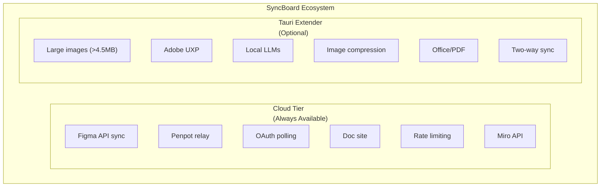

#### What Tauri Enables (Web-Native Cannot)

1. **Large Binary Transport** --- Vercel body limit is 4.5MB. Tauri can chunk and stream multi-megabyte images.
2. **Native Socket/IPC** --- Talk to desktop apps (Adobe UXP plugin, Obsidian local API, local MCP servers).
3. **File System Access** --- Read/write local PDFs, Markdown vaults, Office documents.
4. **Local Compute** --- Run local LLMs (Ollama), Squoosh/WASM compression, format conversion.
5. **Background Sync** --- Long-running two-way watchers between Miro and other tools/databases.
6. **System Integration** --- Notifications, clipboard, tray, auto-update.

### Future: Multi-Whiteboard Platform

The relay-first architecture decouples the sync engine from any single canvas provider. The same plugin + relay pattern extends to:
- **Miro** (current)
- **Mural**
- **FigJam**
- **Microsoft Whiteboard**
- **Excalidraw** (self-hosted)
- **tldraw** (embedded)

Each whiteboard gets a thin plugin that reads/updates widgets and talks to SyncBoard's cloud API. The Tauri extender can optionally enhance any of these with the capabilities above.

### Penpot Transport Evolution

Penpot's transport mechanism went through three distinct phases before reaching the current Ably + Redis relay. Each phase solved a specific constraint:

| Phase | Transport | Mechanism | Problem Solved | Limitation | Applies To |
|-------|-----------|-----------|----------------|------------|------------|
| **v0.4.0 (original)** | Tauri WebSocket | Companion connected via WSS to Tauri's local loopback server (`local.syncboard.com:4401`). Tauri relayed commands between Miro plugin and Penpot companion. | Bypassed mixed-content browser blocks for desktop apps | Chrome PNA blocked all browser -> localhost from web contexts (Miro plugin sandbox, Penpot web app). Only worked in Miro Desktop (Electron). | Miro Desktop only |
| **v0.5.0** | HTTP long-poll (SyncBridge) | Replaced WebSocket with `fetch()` polling using `targetAddressSpace: 'loopback'`. Companion polled `GET /penpot/poll` every ~1s. Tauri used tokio `Notify` signaling to hold long-poll requests for up to 30s. | Passed Chrome's PNA checks for `targetAddressSpace: 'loopback'` | Still required Tauri running locally. 1-second polling caused ~1,000 Redis commands/second when idle if not throttled (fixed in v0.5.2 with 2s delay). Still a localhost dependency. | All browsers (via PNA workaround) |
| **v0.5.1+ (current)** | Cloud relay (Ably + Upstash Redis) | Companion subscribes to Ably WebSocket channel. Commands published via `/api/relay/request` -> Ably -> companion. Results posted to `/api/relay/penpot/result` -> Redis -> Miro plugin. | Eliminated all localhost dependencies. Companion works in any browser without PNA exceptions or Tauri. | Slightly higher latency (network round-trip vs localhost). Requires Ably and Upstash infrastructure (both free-tier viable). | Any browser, any device |

**Why not skip straight to Ably?** The intermediate long-poll phase was necessary because the PNA block was discovered incrementally:
1. First found that WebSockets were blocked from public origins to localhost (PNA).
2. Discovered `targetAddressSpace: 'loopback'` worked for `fetch()` but not WebSocket.
3. Built long-poll bridge as a PNA-compatible workaround.
4. Later realized that even with PNA passable, localhost dependencies still broke in Safari and required Tauri running --- prompting the cloud relay.
5. Ably was chosen because it eliminated the polling cost (instant delivery via WebSocket from cloud, not localhost) and maintained the existing pub/sub command pattern.
