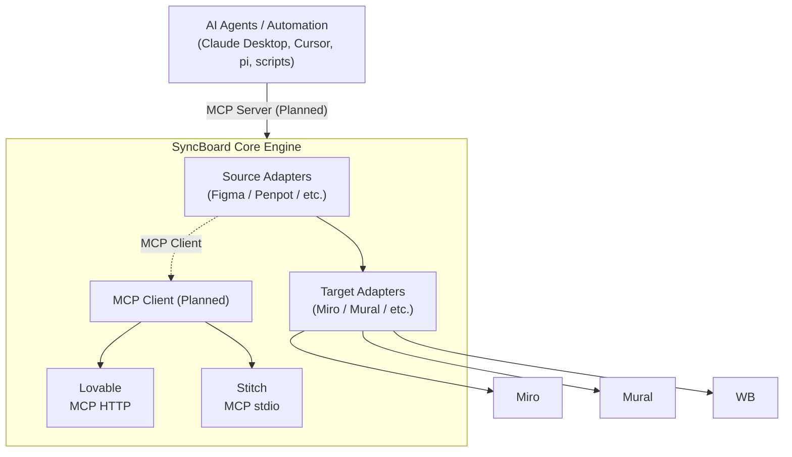

# SyncBoard Architecture & System Design

SyncBoard is a stateless design-to-canvas sync engine designed to fetch, render, and update screenshots in-place on whiteboards. It supports **Figma** and **Penpot** as design sources, **Miro** as the primary canvas target, and is exploring additional platforms.

---

## Quick Status & Module Directory

| Module | Status | Availability | What it covers |
|---|---|---|---|
| **[1. Source Adapters](./architecture/sources.md)** | stable / draft | **Figma & Penpot (LIVE)**; Lovable, Stitch, UXPin, Framer, Adobe UXP *(Planned)* | Cloud REST & Penpot event-driven WASM relay; future source specs. |
| **[2. Target Adapters & Metadata](./architecture/targets.md)** | stable / design | **Miro (LIVE)**; Mural, MS Whiteboard *(Planned)* | Miro SDK v2, REST PATCH, stateless metadata signatures (`[SyncBoard|...]`), `preserveSize`, `replaceSelectedWidget`. |
| **[3. Selection Detection & Relay](./architecture/selection-and-relay.md)** | stable | **LIVE** | Real-time Ably WebSocket selection stream, zero-Redis selection payloads, `companionRelayClient.ts`, secure pairing IDs. |
| **[4. Security & Rate Limits](./architecture/security-and-limits.md)** | stable | **LIVE** | Sliding window rate limiting (`@upstash/ratelimit`), token hashing (`tok:sha256(token)`), Redis `SETEX` 300s OAuth store. |
| **[5. Data Transport & Infrastructure Costs](./architecture/infrastructure-and-costs.md)** | stable | **LIVE** | Vercel 4.5MB limits, byte travel, self-host cost matrix, zero cloud rendering costs, Tauri payload extender. |
| **[6. MCP Transport Roadmap](./architecture/mcp-roadmap.md)** | design | **PLANNED** | Speculative MCP client & server specifications for AI agents. |
| **[7. Historical Archives](./architecture/archive/chromium-loopback.md)** | historical | Archived | [Chromium Loopback & Sandboxing](./architecture/archive/chromium-loopback.md) and [Architecture Evolution Log](./architecture/archive/architecture-evolution.md). |

---

## Architectural Principle: Adapter Layers

SyncBoard is organized into three adapter layers, each interchangeable:

Each adapter implements a uniform interface. Adding a new source means writing a new source adapter; adding a new target means writing a new target adapter. The transport and security layers are shared across all components.
