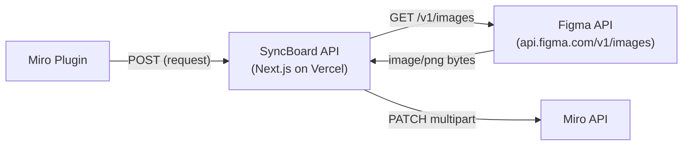
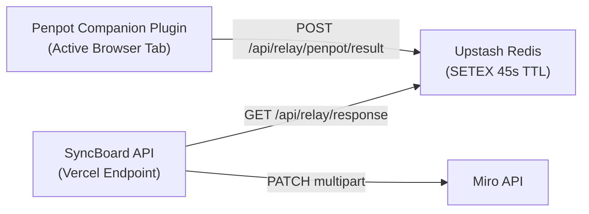

# Data Transport & Infrastructure Costs Architecture

> **Status:** stable — current cost model and payload transport pathways.

Understanding where image bytes travel is critical for evaluating hosting costs, serverless ceilings, and scaling strategies.

---

## Data Path Traces & Byte Flows

### Figma Sync Path (Cloud-Native)

* **Byte Travel:** Image bytes pass through Vercel twice (download from Figma, upload to Miro). Counts against Vercel function execution time (max 60s Pro) and outbound bandwidth.

### Penpot Relay Path (Cloud-Relay)

* **Byte Travel:** Penpot companion renders PNG/SVG in active browser tab ➔ posts to Redis ➔ Miro plugin reads/deletes from Redis ➔ posts to Miro API.

---

## Size Constraints & Serverless Ceilings

| Constraint / Limit | Affected Path | Architectural Mitigation |
|---|---|---|
| **Vercel Serverless Body Limit (4.5MB)** | Image upload to `/api/miro/update-image` | Compress images before upload; offer SVG format; optional Tauri chunk streaming. |
| **Vercel Execution Timeout (10s Hobby / 60s Pro)** | Large batch renders | Batch limit of 3 unique images; 500ms Miro update throttle. |
| **Upstash Redis Value Limit (512MB)** | Penpot base64 exports | Ephemeral 45s TTL auto-deletion; max payload capped by Vercel 4.5MB response limit. |
| **Vercel Outbound Bandwidth (100GB Hobby / 1TB Pro)** | Image downloads & uploads | SVG vector preference (~10x smaller than PNG). |

---

## Hosting & Self-Hosting Cost Matrix

| Hosting Tier | Vercel Plan | Upstash Plan | Monthly Cost | Capacity |
|---|---|---|---|---|
| **Personal / Demo** | Hobby (Free) | Free (10k cmd/day) | **$0 / mo** | Light sync; under 4.5MB per image. |
| **Team Figma Sync** | Pro ($20/mo) | Free (10k cmd/day) | **~$20 / mo** | 1TB bandwidth, 60s execution timeout. |
| **Heavy Penpot Sync** | Pro ($20/mo) | Pay-as-you-go ($0.15/100k cmds) | **~$20–$25 / mo** | High-volume relay messages & Redis single-read buffers. |
| **Enterprise / Private** | Corporate AWS/GCP Docker | Managed Redis | **$0 extra** | Runs on existing corporate container infra; zero per-request limits. |

---

## Cost-Efficient Architectural Principles

1. **No Persistent Servers:** Runs on serverless Vercel endpoints and serverless Upstash Redis.
2. **Zero Cloud Rendering Costs:** Shape rendering runs locally on the designer's GPU/CPU inside the Penpot browser tab — **$0 cloud compute cost**.
3. **Zero Persistent Blob Storage:** Images flow through Vercel/Redis ephemerally into Miro — no S3 buckets or CDN storage required.
4. **SVG-First Strategy:** Prefers vector SVG for Penpot exports, reducing bandwidth by 10x compared to high-resolution PNGs.

---

## How Tauri Reduces Infrastructure Costs

When the optional Tauri desktop app is active:
* **Direct Multipart Uploads:** Tauri streams multi-megabyte image chunks directly to Miro API, completely bypassing Vercel's 4.5MB serverless body limit and saving Vercel outbound bandwidth.
