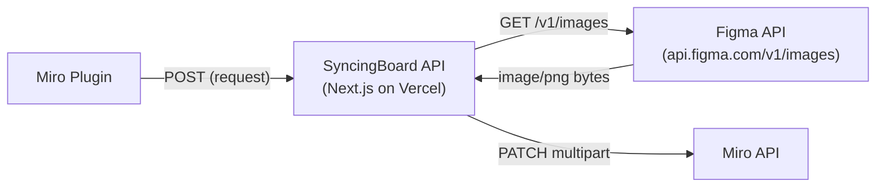
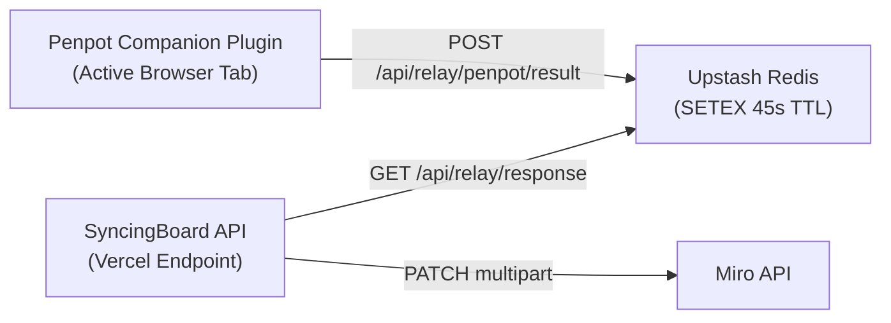

# Data Transport & Infrastructure Costs Architecture

> **Status:** stable — current cost model and payload transport pathways.

Understanding where image bytes travel is critical for evaluating hosting costs, serverless ceilings, and scaling strategies.

---

## Data Path Traces & Byte Flows

### Figma Sync Path (Cloud-Native)

* **Byte Travel:** Image bytes pass through Vercel twice (download from Figma, upload to Miro). Counts against Vercel function execution time (max 60s Pro) and outbound bandwidth.

### Penpot Relay Path (Cloud-Relay)

* **Byte Travel:** Penpot companion renders PNG/SVG in active browser tab ➔ posts to Redis ➔ Miro plugin reads/deletes from Redis ➔ posts to Miro API.

---

## Size Constraints & Serverless Ceilings

## Size Constraints & Serverless Ceilings

| Constraint / Limit | Affected Path | Architectural Mitigation |
|---|---|---|
| **Vercel Serverless Body Limit (4.5MB)** | Image upload to `/api/miro/update-image` | Compress images before upload; offer SVG format; optional Tauri chunk streaming. |
| **Vercel Execution Timeout (10s Hobby / 60s Pro)** | Large batch renders | Batch limit of 3 unique images; 500ms Miro update throttle; Retry-After backoff (capped at 10s). |
| **Upstash Redis Value Limit (256MB Data Size)** | Penpot base64 exports | Ephemeral 180s TTL auto-deletion (`SETEX 180`); max payload capped by Vercel 4.5MB response limit. |
| **Upstash Redis Monthly Command Pool (500,000 Cmds)** | Rate-limiting & Penpot relay | Slowed OAuth polling (4s interval); scoped backstops (auxiliary endpoints excluded from global counter). |
| **Ably Realtime Connection Limit (200 WebSockets)** | Selection relay & Penpot status | Redis Lua `ZSET` session lease (`acquireRelaySession`) capping active Miro relay clients at **40 concurrent leases** (one WebSocket per relay client (channels multiplex), so 40 leases ≈ 40 WebSockets, leaving ~160 for reconnects and open companions), with a **1-board-per-user binding** (`relay:user_board:{userIdHash}`, 30-min TTL refreshed per heartbeat) + one-click session transfer (v0.15.1). |
| **Vercel Outbound Bandwidth (100GB Hobby / 1TB Pro)** | Image downloads & uploads | SVG vector preference (~10x smaller than PNG). |

---

## Free-Tier Capacity & Quota Safety Proof

Under a **500 global daily sync cap** (500 syncs/day = 15,000 syncs/month), **monthly quota exhaustion is mathematically impossible** across all free-tier providers:

1. **Ably Realtime (6,000,000 Messages / Month Pool):**
   - Max usage at 500 syncs/day: 500 syncs/day * 4 msgs/sync * 30 days = **60,000 msgs/month**.
   - **Result:** Uses **1% of Ably's monthly free allowance**.
2. **Upstash Redis (500,000 Commands / Month Pool & 10 GB Bandwidth):**
   - Max usage at 500 syncs/day (3,000 cmds/day) + OAuth polling (~1,500 cmds/day):
     (3,000 + 1,500) cmds/day * 30 days = **135,000 cmds/month**
   - **Result:** Uses **27% of Upstash's monthly free allowance**.
3. **Vercel Serverless (100,000 Invocations & 100 GB Bandwidth / Month):**
   - Max invocations: 500 * 3 execs * 30 = **45,000 invocations/month** (**45% of Vercel limit**).
   - Max bandwidth: 500 * 0.5 MB * 30 = **7.5 GB/month** (**7.5% of Vercel limit**).

---

## Hosting & Self-Hosting Cost Matrix

| Hosting Tier | Vercel Plan | Upstash Plan | Ably Plan | Monthly Cost | Capacity |
|---|---|---|---|---|---|
| **Community Free** | Hobby (Free) | Free (500k cmd/mo) | Free (200 conns/6M msgs) | **$0 / mo** | 40 active sessions (1 board per user); 500 syncs/day; under 4.5MB per image. |
| **Team Figma Sync** | Pro ($20/mo) | Free (500k cmd/mo) | Free (200 conns/6M msgs) | **~$20 / mo** | 1TB bandwidth, 60s execution timeout, 1M invocations. |
| **Heavy Penpot Sync** | Pro ($20/mo) | Pay-as-you-go ($0.20/100k cmds) | Standard ($29/mo) | **~$50–$55 / mo** | High-concurrency relay messages & Redis single-read buffers. |
| **Enterprise / Private** | Corporate AWS/GCP Docker | Managed Redis | Optional | **$0 extra** | Runs on existing corporate container infra; zero per-request limits. |

---

## Cost-Efficient Architectural Principles

1. **No Persistent Servers:** Runs on serverless Vercel endpoints and serverless Upstash Redis.
2. **Zero Cloud Rendering Costs:** Shape rendering runs locally on the designer's GPU/CPU inside the Penpot browser tab — **$0 cloud compute cost**.
3. **Zero Persistent Blob Storage:** Images flow through Vercel/Redis ephemerally into Miro — no S3 buckets or CDN storage required.
4. **SVG-First Strategy:** Prefers vector SVG for Penpot exports, reducing bandwidth by 10x compared to high-resolution PNGs.

---

## How Tauri Reduces Infrastructure Costs

When the optional Tauri desktop app is active:
* **Direct Multipart Uploads:** Tauri streams multi-megabyte image chunks directly to Miro API, completely bypassing Vercel's 4.5MB serverless body limit and saving Vercel outbound bandwidth.
