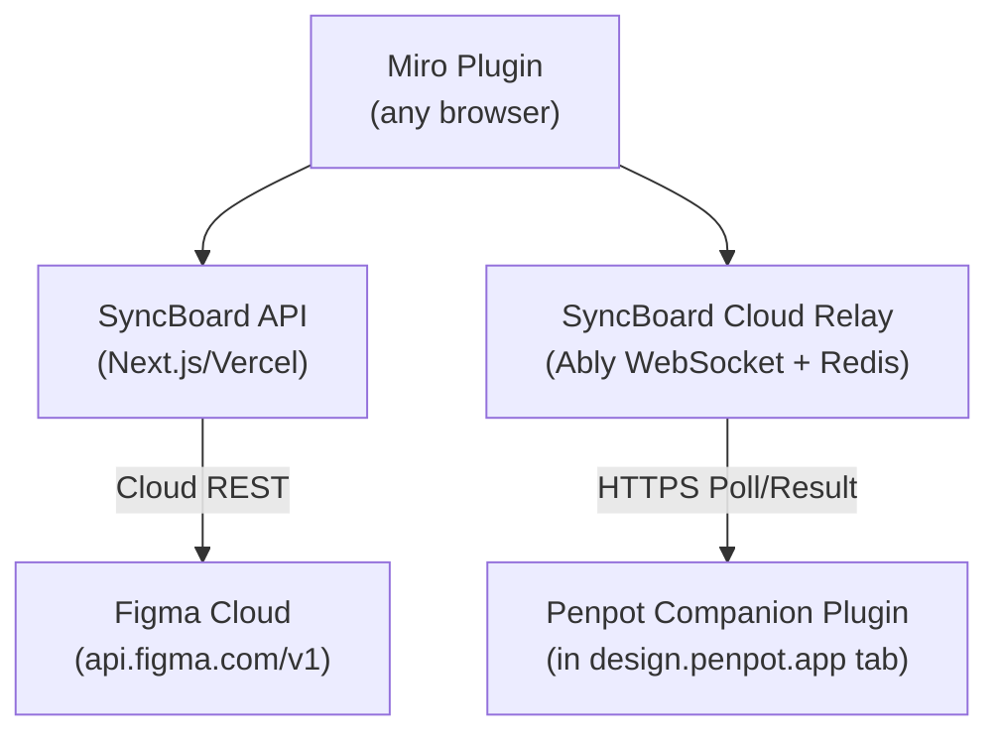

# Source Adapters Architecture

> **Overview:** SyncBoard reads design data from source design tools through platform-specific adapters. Two are implemented (**Figma**, **Penpot**); five more are under research (**UXPin**, **Framer**, **Lovable**, **Stitch**, **Adobe UXP**).

**Implementation Note (v0.13.3):** While `SyncSourceAdapter` represents the target architectural interface for future integrations (Lovable, Stitch), `v0.13.3` currently implements Figma and Penpot directly via custom serverless endpoints (`/api/figma/...`, `/api/relay/...`) and dedicated React importer hooks (`useFigmaImporter`, `usePenpotImporter`).



---

## Figma — Cloud-Native REST + Companion Relay

Figma provides a robust public web API that renders design frames to images in the cloud (`api.figma.com/v1/images`), while using an Ably WebSocket companion plugin for real-time selection auto-detect.

* **Image Sync Flow:** The Miro plugin requests frame renders via `/api/figma/render-batch`. The server requests the frame render directly from Figma's cloud REST API (`api.figma.com/v1/images`), downloads the image bytes, and uploads them to the Miro widget via multipart POST.
* **Selection Auto-Detect Flow (Ably WebSocket):** For real-time selection auto-detect inside Figma Desktop, the Figma Companion plugin (`public/figma-companion-ui.html`) connects via an Ably WebSocket channel (`penpot:${pairingId}`). When selection changes, it publishes metadata (`id`, `name`, `fileKey`) over Ably directly to the Miro plugin sidebar with zero server polling and zero Redis overhead.
* **Benefits:** Zero user configuration, no local servers, and no tunnels required for private setups.

### The Cloud Key Limitation (Figma Community Restriction)
Figma enforces access control on `figma.fileKey` in its client-side plugin API:
* **Private/Organization Plugins:** Can query `figma.fileKey` automatically by setting `"enablePrivatePluginApi": true` in `manifest.json`.
* **Public/Community Plugins:** Figma blocks access to `figma.fileKey` (returns `undefined`) to preserve document privacy.
* **The Metadata Workaround:** To support public community installations, SyncBoard implements a document-level linking bridge:
  1. The first time a Figma file is opened, the user pastes the Figma URL once in the Companion UI.
  2. The plugin extracts `fileKey` and saves it in document metadata using `figma.root.setPluginData('syncboard_file_key', fileKey)`.
  3. This metadata persists within the `.fig` file in Figma's cloud, enabling companion selection auto-detection.

---

## Penpot — Cloud Relay + Companion Plugin

> **Status:** stable — implemented in production.

Unlike Figma, Penpot does **not** provide a public cloud REST API for rendering frames into PNG/SVG. Syncing Penpot designs uses an event-driven cloud relay to coordinate the designer's active Penpot browser tab:

* **The Cloud Limitation:** Rendering Penpot designs in the cloud would require booting a headless browser instance (Puppeteer/Playwright), loading the heavy WebAssembly editor, and taking screenshots — requiring expensive compute nodes.
* **The Event-Driven Relay Solution:** SyncBoard uses the designer's **active Penpot browser tab** as the renderer, coordinated via **Ably WebSockets** for instant real-time delivery and an ephemeral **Upstash Redis** cache for heavy binary result storage.
* **Direct Selection (0 Redis Commands):** Selection payloads (`id`, `name`, `fileKey`) are published directly over the Ably WebSocket channel back to the Miro plugin sidebar, bypassing Redis entirely.
* **Hybrid Image Storage (Single-Read Redis):** Heavy PNG/SVG renders are posted to `/api/relay/penpot/result` (stored in Redis with a 45s TTL) and a tiny `'result-ready'` notification event is published over Ably. The Miro plugin receives the WebSocket event and reads/deletes the image with a single `GET /api/relay/response` call (3 Redis commands total per export: 1 SET, 1 GET, 1 DEL).

### Penpot Export Freeze & `openPage` Navigation Workaround

To save RAM, Penpot only loads the active page into WebAssembly (WASM) rendering memory. Background pages remain unparsed in storage.

* **Why Unopened Pages Freeze Penpot:** Exporting a shape from an un-hydrated background page forces Penpot to parse and calculate the entire background page tree synchronously on the browser's main JavaScript thread. This locks up the browser tab for **10 to 60 seconds** (triggering Chrome's *"Page Unresponsive"* dialog).
* **The 3-Step `openPage` Preload Solution:**
  1. **Preload (`await penpot.openPage(targetPage)`)**: The plugin switches to the target shape's page first, triggering Penpot's native page loader to hydrate WASM memory asynchronously in **~0.5s**.
  2. **Hot Export (`await shape.export()`)**: With the page active in WASM memory, `shape.export()` reads from hot cache and completes in **< 1s** with zero main-thread freezing.
  3. **Restore View (`await penpot.openPage(originalPageId)`)**: Immediately after capturing the binary image ArrayBuffer, the plugin navigates back to the designer's original page view automatically.

```javascript
// Step 1: Preload target page into WASM memory
if (shapeIsOnBackgroundPage) {
  await penpot.openPage(targetPage);
}

// Step 2: Fast export from hot WASM memory (< 1s)
const result = await shapeFromPage.export({ type: format, scale });

// Step 3: Return designer to original page
await penpot.openPage(originalPageId);
```

---

## UXPin (Research Target)

UXPin offers a REST API and a client-side JavaScript plugin system:
* **Cloud-Native Path (Figma pattern):** REST API supports project-level export (`GET /api/v1/projects`), but lacks per-frame batch rendering endpoints.
* **Cloud-Relay Path (Penpot pattern):** Plugin API runs inside the editor, reads selected nodes, and exports canvas surfaces. Requires verification of per-node export API surface.

---

## Framer (Research Target)

Framer pivoted to a website builder and exposes a client-side Plugin API and a server-side WebSocket API:
* **Plugin API:** Exposes selection detection (`subscribeToSelection`), node property reading (`getNode`), and asset importing (`addImage`), but lacks an export/render API for draft designs.
* **Server API:** Bidirectional streaming WebSocket for managing published sites (`publishPreviewLink`, `promoteToProduction`).
* **Verdict:** Pre-deployment frame sync is unviable without headless browser infrastructure. Post-deployment website screenshots via published `.framer.site` URLs are viable for whole-page reviews.

---

## Lovable — MCP HTTP Integration (Research Target)

Lovable (formerly GPT Engineer) provides an official HTTP MCP server (`mcp.lovable.dev`):
* **MCP Tools:** `get_project` returns project details, preview URL, and direct server-rendered screenshots without Puppeteer or client-side rendering infrastructure.
* **Sync Modes:** Supports static image sync (pushed to Miro image widget) or live embed link cards inserted into Miro.

---

## Stitch — Google MCP Integration (Research Target)

Google Stitch community MCP server (`stitch-mcp`):
* **MCP Tools:** `fetch_screen_image` downloads high-res screen renders directly from Google Stitch API.
* **Transport:** stdio process or hosted TCP bridge, authenticated via Google Cloud Application Default Credentials (ADC).

---

## Adobe UXP (Research Target)

Adobe UXP (Unified Extensibility Platform) for Photoshop / Illustrator:
* **Cloud Storage API Path:** `GET /files/{assetId}/image-rendition` offers cloud-native document rendition retrieval.
* **UXP Plugin Path (Tauri-dependent):** UXP plugin inside Photoshop/Illustrator reads active selections and exports PNG/SVG files relayed to Tauri local sockets.
