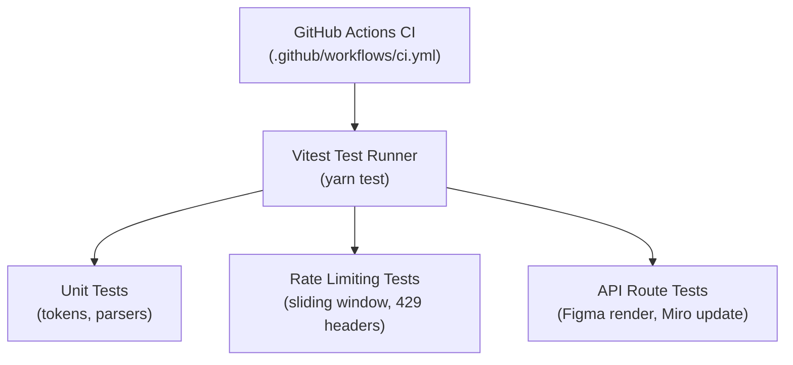

# Testing & Quality Assurance

SyncingBoard enforces strict automated testing across security, rate limiting, URL parsing, and serverless API endpoints using **Vitest**.

---

## Testing Strategy & Infrastructure

SyncingBoard's test suite runs inside **Vitest** (`yarn test`) in zero-network isolation. All external Figma, Miro, Ably, and Upstash Redis network calls are mocked to ensure 100% deterministic test execution in under 3 seconds.



---

## Test Suites Breakdown

SyncingBoard includes **76 passing automated tests** across 11 specialized test files:

| Test File | Category | Focus Area & Assertions |
| :--- | :--- | :--- |
| **`src/lib/tokens.test.ts`** | Security | Cryptographic token security, SHA-256 one-way hashing (`tok:sha256(token)`), pairing ID generation, and entropy validation. |
| **`src/lib/docs.test.ts`** | Docs Engine | Document indexing, case-insensitive slug resolution (`/docs/LICENSE`), heading extraction, and word counts. |
| **`src/app/miro-plugin/figmaUrlParser.test.ts`** | Parsers | Regex extraction of `fileKey` and `nodeId` from Figma web URLs, desktop app links, and frame selection parameters. |
| **`src/app/miro-plugin/penpotUrlParser.test.ts`** | Parsers | Regex extraction of `fileId`, `pageId`, and `shapeId` from Penpot workspace URLs. |
| **`src/lib/rate-limit.test.ts`** | Rate Limiting | Sliding-window algorithm, token-hash caller identification, daily budget counters, and `429 Too Many Requests` JSON body + `Retry-After` headers. |
| **`src/app/api/oauth/store/route.test.ts`** | OAuth Handshake | Temporary 300s Redis OAuth state store (`POST /api/oauth/store`) and one-time token retrieval/deletion (`GET` + `DEL`). |
| **`src/app/api/docs/search/route.test.ts`** | Search Engine | Full-text search endpoint (`GET /api/docs/search?q=...`), relevancy scoring, section deep-linking, and term highlighting. |
| **`src/app/api/figma/render/route.test.ts`** | API Routes | Figma cloud REST image rendering endpoint (`POST /api/figma/render`), scale parameter validation, and binary image stream forwarding. |
| **`src/app/api/figma/render-batch/route.test.ts`** | API Routes | Multi-frame batch rendering (`POST /api/figma/render-batch`), 3-frame batch cap enforcement, and payload transformation. |
| **`src/app/api/figma/node-info/route.test.ts`** | API Routes & Fallbacks | Figma frame metadata extraction (`POST /api/figma/node-info`) and fallback title resolution during network exceptions. |
| **`src/app/api/miro/update-image/route.test.ts`** | API Routes & Canvas | Miro image widget binary updating (`PATCH /api/miro/update-image`), multipart form parsing, and `title` metadata signature preservation. |

---

## Running Tests Locally

Run the test suite during development using the following commands:

```bash
# Run all 63+ tests once
yarn test

# Run tests in interactive watch mode
yarn test --watch

# Run tests with UI dashboard
yarn test --ui

# Verify TypeScript types and ESLint rules
yarn lint

# Verify full production build compilation
yarn build
```

---

## Mocking Principles & Zero-Network Guarantee

To ensure tests execute fast without requiring real API keys or external services:

1. **Figma REST API:** Mocked via `global.fetch` spies returning sample JSON frame hierarchies and binary PNG buffers.
2. **Upstash Redis:** Mocked using in-memory sliding window state stores (`Map<string, { count, reset }>`) so rate-limiting logic is tested without live Redis connections.
3. **Miro Web SDK:** Mocked using synthetic widget objects asserting `isLocked`, `title`, and `scale` properties.
